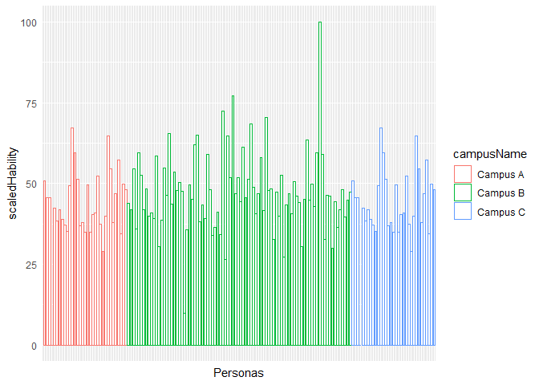

pycho-test
==========

Problema
--------

En tres campus (Campus A, Campus B y Campus C) se aplicó un examen para
medir habilidades lectoras de niños de 6o de primaria en los ciclos
escolares (year) 2017-2018 (2018) y 2018-2019 (2019). El examen tiene 39
reactivos; cada reactivo (idQuestion) tiene una dificultad y
discriminación distintas (por estimar, utilizando el modelo Rasch), y
cada niño contestó (o dejó en blanco) correcta o incorrectamente estas
preguntas.

A partir de los datos proporcionados, contestar:

1.  En un data frame, ¿cuáles son los parámetros (dificultad y
    discriminación) de los ítems en 2018?

2.  El ranking de las escuelas por nivel académico

3.  El ranking de los alumnos dentro de una escuela por nivel de
    habilidad

4.  Dados los parámetros del modelo 2018, ¿los alumnos 2019 mejoraron o
    empeoraron en general (todos los campus) y por campus (qué campus
    empeoró, qué campus mejoró, qué campus se quedó igual)?

Respuestas:
-----------

### Intoducción

El modelo Rasch es ampliamente usado para el análisis de datos
educacionales. En la práctica dado un test, se reportan los estimadores
de la dificultad y discriminación de los ítems y los estimadores de las
habilidades de los individuos. Para ver una introducción bastante
intuitiva de este modelo puede consultar
<a href="http://dx.doi.org/10.15517ap.v29i119.18911" class="uri">http://dx.doi.org/10.15517ap.v29i119.18911</a>

En R existe una implementación del del modelo de Rasch dentro del
paquete TAM con diversas variantes, en particular para este problema
utilizaremos las funciones

-   `TAM::tam.mml.2pl`
-   `TAM::tam.wle`

La primera sirve para estimar los parámetros de dificultad y
discriminación de los items y la segunda para estimar el parámetro de la
habilidad de los individuos. Se puede consultar la documentación de
estas en los siguientes links:

-   <a href="https://www.rdocumentation.org/packages/TAM/versions/2.13-15/topics/tam.mml" class="uri">https://www.rdocumentation.org/packages/TAM/versions/2.13-15/topics/tam.mml</a>
-   <a href="https://www.rdocumentation.org/packages/TAM/versions/2.13-15/topics/tam.wle" class="uri">https://www.rdocumentation.org/packages/TAM/versions/2.13-15/topics/tam.wle</a>

En `eda.R` implementamos estas dos funciones dentro de la función
`raschModel` esta función tiene las siguientes caracteristicas:

### `raschModel`

Función que recibe como parámetro el año y regresa tres dataframes
correspondientes a los parametros de este año utilizando el modelo de
Rash. Es un hecho conocido que estas estimaciones por lo general estan
todas en el intervalo \[-5,5\] es por eso que algunos casos los
resultados pueden parecer poco intutivos por eso hacemos una
“normalización” que mapea estos datos al intervalo \[0,100\] en el
calculo de rankigs.

### Uso

`raschModel(año)`

### Argumentos

año: numero entero correspondiente al año para el cual se calcularan los
parámetros del modelo de Rasch

### Valores que regresa

Una lista con los siguientes dataframes:

> DaDf:

> -   Es un dataframe con los campos dificultad y discrimicación que
>     contiene la estimacion de estos parámetros para el modelo de Rasch
>     y se calculan utilizando la libreia TAM que incluye funciones para
>     estimar los parámetros del modelo de Rasch en partricular se
>     utiliza `TAM::tam.mml.2pl` que recibe como parámetro principal un
>     dataframe donde los identificadores de los items son los headers y
>     los datos son 0 si el item se contesto incorrectamente, 1 si el
>     item se contesto correctamente y NA si no se contesto y regresa un
>     objeto con los parámetros habilidad y discriminación junto con mas
>     información.

> habilidadDf:

> -   Es un Dataframe con los campos campusName, idUser\_int, habilidad
>     y scaledHability, la habilidad se calcula utlizando la función
>     `TAM::tam.wle` que recibe como parámetros el objeto que devuelve
>     `TAM::tam.mml.2pl` y el campo scaledHability es una
>     “normalización” entre 0 y 100 del parámetro habilidad.

> rankingCampus:

> -   Es un dataframe con los campos campusName que contiene los nombres
>     de los campus y ranking que contiene el ranking de cada campus,
>     este rankink se calcula como la habilidad promedio de los
>     individuos en el campus en una escala de 0 a 100

### Fuente

``` r
raschModel<-function(ciclo){
  #Costruimos un dataframe con los datos requeridos para TAM::tam.mml.2pl
  itemDf <- tidy.test.data %>% filter(year==ciclo) %>% spread(key=idQuestion,value=isCorrect)
  resp <- itemDf %>% select(-c("year", "campusName","idUser_int"))
  #utilizaremos TAM::tam.mml.2pl por que es el unico que estima las pendientes, es decir, el parámetro
  #de discriminacón
  rashM <- TAM::tam.mml.2pl(resp=resp,irtmodel="2PL",verbose=FALSE)

  #Construimos el dataframe con los parametros dificultad y discriminacion para los items de 2018
  # rash2018$item$AXsi_.Cat1 => dificultad para cada pregunta
  # rash2018$item$B.Cat1.Dim1 => discriminación para cada pregunta
  DaDDf <- rashM$item %>% select(AXsi_.Cat1, B.Cat1.Dim1)
  colnames(DaDDf)<-c('dificultad','discriminación')
  #En DaDDf esta el dataframe con los parámetros dificultad y discriminación por pregunta

  #utilizaremos TAM::tam.wle para calcular la habilidad de cada persona
  rashH <-TAM::tam.wle(rashM,progress=FALSE)

  #almacenamos las habilidades en un dataframe
  habilidad <- as.data.frame(rashH$theta)
  habilidadDf <- data.frame(itemDf$campusName,itemDf$idUser_int,habilidad)
  colnames(habilidadDf)<-c("campusName","idUser_int","habilidad")

  #Scalamos el score de las habilidades entre 0 y 100
  minh = min(habilidadDf$habilidad)
  maxh = max(habilidadDf$habilidad)
  habilidadDf$scaledHability<-with(habilidadDf,((habilidad-minh)/(maxh-minh))*100)

  #Calculamos el ranking entre 0 y 100 por escuela
  rankingCampus<-aggregate(scaledHability~campusName,habilidadDf,mean)
  colnames(rankingCampus)<-c("campusName","ranking")
  vareturn <- list("DaDDf"=DaDDf,"habilidadDf"=habilidadDf,"rankingCampus"=rankingCampus)
  return(vareturn)
}
```

### Implementación

-   Para cargar la función `raschModel` ejecutamos la siguiente
    instrucción:

``` r
source("src/eda.R")
```

    ## Load clean data from file test_data.csv in tidy.test.data 
    ## Save clean data from file test_data.csv in data/tidy test_data.csv

-   Estimamos los parámetros para los años 2018 y 2019

``` r
M2018 <- raschModel(2018)
M2019 <- raschModel(2019)
```

-   Definimos una función para normalizar datos

``` r
normaliza<-function(lista){
  minimo = min(lista)
  maximo = max(lista)
  rango = maximo -minimo
  listan = ((lista - minimo)/rango)*100
  return(listan)
}
```

#### 1. Mostramos el dataframe con la estimación de los parametros dificultad y discriminación de los items para el año 2018.

``` r
#construimos el datframe
#dificultad normalizada entre 0 y 100
dificultadn = normaliza(M2018$DaDDf$dificultad)
#discrimización normalizada entre 0 y 100 
discriminacionn = normaliza(M2018$DaDDf$discriminacion)
tableItem1 <- data.frame(row.names(M2018$DaDDf),M2018$DaDDf$dificultad,M2018$DaDDf$discriminacion,dificultadn,discriminacionn)
colnames(tableItem1)<-c('Pregunta','Dificultad','Discriminación','Dificultad(Escala 0 a 100)','Discriminacion(Escala 0 a 100)')
```

    tableItem1

| Pregunta     |  Dificultad|  Discriminación|  Dificultad(Escala 0 a 100)|  Discriminacion(Escala 0 a 100)|
|:-------------|-----------:|---------------:|---------------------------:|-------------------------------:|
| L-G4-2009-59 |   1.3749495|       1.3597784|                    80.70686|                      100.000000|
| L-G4-2009-60 |   1.4901280|       0.9825621|                    87.53533|                       68.145533|
| L-G4-2009-61 |   0.6141091|       0.6992154|                    35.59970|                       44.217994|
| L-G4-2009-62 |   0.9402202|       0.8574895|                    54.93351|                       57.583627|
| L-G4-2009-63 |   1.1031406|       0.3016236|                    64.59241|                       10.642896|
| L-G4-2011-32 |   0.5614806|       0.7727688|                    32.47957|                       50.429295|
| L-G4-2011-33 |   0.2485436|       0.5668340|                    13.92680|                       33.038890|
| L-G4-2011-34 |   0.6806086|       0.2099128|                    39.54219|                        2.898269|
| L-G4-2011-35 |   0.9972909|       1.0833372|                    58.31701|                       76.655598|
| L-G4-2011-36 |   0.8932601|       1.1136421|                    52.14944|                       79.214736|
| L-G4-2011-46 |   0.4122571|       0.8274189|                    23.63271|                       55.044280|
| L-G4-2011-47 |   1.1952638|       0.1755919|                    70.05402|                        0.000000|
| L-G4-2011-48 |   1.7003745|       0.9323016|                   100.00000|                       63.901221|
| L-G4-2013-15 |   0.1853089|       0.2823425|                    10.17787|                        9.014675|
| L-G4-2013-16 |   0.3618991|       0.9807148|                    20.64719|                       67.989537|
| L-G4-2013-18 |   0.0136347|       1.0689509|                     0.00000|                       75.440735|
| L-G4-2013-20 |   1.6425319|       0.3863973|                    96.57074|                       17.801709|
| L-G4-2013-21 |   0.6456756|       0.7018814|                    37.47116|                       44.443126|
| L-G4-2013-23 |   0.5549854|       0.4499402|                    32.09450|                       23.167660|
| L-G4-2013-24 |   0.7772723|       1.0785173|                    45.27299|                       76.248576|
| L-G4-2013-25 |   0.2233348|       0.6556491|                    12.43227|                       40.538982|

#### 2. Mostramos las tablas con los ranking de las escuelas

    M2018$rankingCampus

| campusName |   ranking|
|:-----------|---------:|
| Campus A   |  43.37464|
| Campus B   |  47.34418|
| Campus C   |  43.37464|

    M2019$rankingCampus

| campusName |   ranking|
|:-----------|---------:|
| Campus A   |  29.01340|
| Campus B   |  48.14079|
| Campus C   |  29.01340|

#### 3. Mostramos las tablas con los ranking de los alumnos dentro de una escuela por nivel de habilidad

-   Veamos una gráfica de los tres campus para darnos una idea general:

Grafica comparativa

``` r
ggplot(M2018$habilidadDf, aes(y=scaledHability,x=paste(campusName,idUser_int,sep = '-'),color=campusName)) + 
geom_bar(stat="identity", fill="white")+
theme(axis.text.x = element_blank(), axis.ticks = element_blank())+
labs(x = "Personas")
```



En esta gráfica podemos observar que el Campus B tiene mas personas que
los otros dos campus y que en promedio sus personas son mas habiles que
las de los campus anteriores, más aun los campus A y C parecen ser
practicamente iguales (supongo que asi se generaron los datos)

-   Ahora calculemos cada dataframe

``` r
#Seleccionamos los alumnos del Campus A
habilidadCampusA <- M2018$habilidadDf %>% filter(campusName=="Campus A")
```

    habilidadCampusA

| campusName |  idUser\_int|   habilidad|  scaledHability|
|:-----------|------------:|-----------:|---------------:|
| Campus A   |         1124|   0.5563113|        50.75784|
| Campus A   |         1125|   0.0300471|        45.65201|
| Campus A   |         1127|   0.0260228|        45.61296|
| Campus A   |         1128|  -4.6753578|         0.00000|
| Campus A   |         1129|  -0.2959689|        42.48899|
| Campus A   |         1130|  -0.7130372|        38.44257|
| Campus A   |         1131|  -0.3547296|        41.91889|
| Campus A   |         1132|  -0.6726510|        38.83440|
| Campus A   |         1133|  -0.8363308|        37.24638|
| Campus A   |         1135|  -1.0394699|        35.27551|
| Campus A   |         1136|   0.4130489|        49.36790|
| Campus A   |         1137|   2.2448674|        67.14027|
| Campus A   |         1138|   1.4628127|        59.55275|
| Campus A   |         1139|   0.6163780|        51.34061|
| Campus A   |         1140|  -0.8799330|        36.82335|
| Campus A   |         1141|  -0.7639327|        37.94879|
| Campus A   |         1142|  -1.0829222|        34.85394|
| Campus A   |         1143|   0.4454662|        49.68242|
| Campus A   |         1144|  -1.0853463|        34.83042|
| Campus A   |         1145|  -0.5042478|        40.46826|
| Campus A   |         1146|  -0.4619190|        40.87893|
| Campus A   |         1148|   0.7280768|        52.42431|
| Campus A   |         1149|  -0.8179439|        37.42477|
| Campus A   |         1150|  -1.6911978|        28.95243|
| Campus A   |         1151|  -0.5610148|        39.91750|
| Campus A   |         1152|   1.9919480|        64.68644|
| Campus A   |         1524|   0.9407414|        54.48759|
| Campus A   |        39254|  -0.7764635|        37.82721|
| Campus A   |        39255|   0.1541755|        46.85630|
| Campus A   |        39257|   1.2354581|        57.34695|
| Campus A   |        39260|  -1.1310996|        34.38652|
| Campus A   |        39272|   0.4610353|        49.83347|
| Campus A   |        41757|   0.2826229|        48.10251|

``` r
#Seleccionamos los alumnos del Campus A
habilidadCampusB <- M2018$habilidadDf %>% filter(campusName=="Campus B")
```

    habilidadCampusB

| campusName |  idUser\_int|   habilidad|  scaledHability|
|:-----------|------------:|-----------:|---------------:|
| Campus B   |        18273|  -0.1553309|       43.853461|
| Campus B   |        18274|  -0.3530706|       41.934984|
| Campus B   |        18278|   0.9349578|       54.431481|
| Campus B   |        18283|  -0.9712250|       35.937628|
| Campus B   |        18284|   1.4519834|       59.447682|
| Campus B   |        18288|   0.7393201|       52.533397|
| Campus B   |        18293|  -0.3676011|       41.794008|
| Campus B   |        18303|   0.3080132|       48.348843|
| Campus B   |        18306|  -0.5497407|       40.026884|
| Campus B   |        18310|  -0.4636993|       40.861660|
| Campus B   |        18312|  -0.6477224|       39.076261|
| Campus B   |        18315|   1.3648065|       58.601889|
| Campus B   |        18316|  -1.5291279|       30.524834|
| Campus B   |        18320|  -0.6887845|       38.677875|
| Campus B   |        18328|   0.9712405|       54.783497|
| Campus B   |        18329|   0.0940627|       46.273087|
| Campus B   |        18330|   2.0825222|       65.565192|
| Campus B   |        18331|  -0.1801020|       43.613131|
| Campus B   |        18332|   0.8454796|       53.563360|
| Campus B   |        18333|   0.2446627|       47.734213|
| Campus B   |        18334|   0.5193991|       50.399716|
| Campus B   |        18337|   0.2356531|       47.646802|
| Campus B   |        18338|  -3.6672210|        9.780979|
| Campus B   |        18340|  -0.9997785|       35.660601|
| Campus B   |        18345|   0.4465661|       49.693087|
| Campus B   |        18346|  -0.0331705|       45.038666|
| Campus B   |        18348|   1.7247633|       62.094202|
| Campus B   |        18351|   2.0214161|       64.972338|
| Campus B   |        18354|  -0.7483960|       38.099523|
| Campus B   |        18355|  -0.1922225|       43.495537|
| Campus B   |        18372|  -0.6486091|       39.067658|
| Campus B   |        18373|   1.4118093|       59.057911|
| Campus B   |        18374|   0.2778436|       48.056136|
| Campus B   |        18376|  -1.1743051|       33.967337|
| Campus B   |        18377|  -0.9184598|       36.449558|
| Campus B   |        18384|  -0.4225317|       41.261070|
| Campus B   |        18389|  -1.1495625|       34.207391|
| Campus B   |        18390|   2.7806932|       72.338871|
| Campus B   |        18392|  -1.9548361|       26.394598|
| Campus B   |        18395|   1.9968750|       64.734239|
| Campus B   |        18396|   0.6650742|       51.813061|
| Campus B   |        18399|   3.2665341|       77.052517|
| Campus B   |        18402|   0.1422411|       46.740516|
| Campus B   |        18403|   0.6637137|       51.799861|
| Campus B   |        18406|  -0.0907443|       44.480082|
| Campus B   |        18407|   1.6303376|       61.178080|
| Campus B   |        18413|   0.0139937|       45.496255|
| Campus B   |        18420|   0.6268996|       51.442689|
| Campus B   |        18428|   2.3736323|       68.389552|
| Campus B   |        18437|   0.3690047|       48.940584|
| Campus B   |        18444|  -0.4845894|       40.658984|
| Campus B   |        18450|   0.1599455|       46.912284|
| Campus B   |        18460|   1.3065927|       58.037096|
| Campus B   |        18464|  -0.3883371|       41.592827|
| Campus B   |        18466|   2.5807839|       70.399344|
| Campus B   |        18469|   0.2586373|       47.869796|
| Campus B   |        18471|   0.3003876|       48.274858|
| Campus B   |        18480|  -1.3063621|       32.686116|
| Campus B   |        18481|   0.2017752|       47.318118|
| Campus B   |        18487|  -0.5568227|       39.958174|
| Campus B   |        18488|   0.7523097|       52.659423|
| Campus B   |        18489|  -1.8715425|       27.202715|
| Campus B   |        18491|  -0.1919730|       43.497959|
| Campus B   |        18492|   0.1561242|       46.875210|
| Campus B   |        18505|  -0.4742243|       40.759546|
| Campus B   |        18542|   0.5503121|       50.699634|
| Campus B   |        18544|   0.0890912|       46.224854|
| Campus B   |        18548|  -0.1271285|       44.127082|
| Campus B   |        18553|  -1.5394231|       30.424949|
| Campus B   |        18555|  -0.0205961|       45.160663|
| Campus B   |        18567|   1.8780974|       63.581855|
| Campus B   |        18573|  -0.0474257|       44.900361|
| Campus B   |        18577|   0.4684479|       49.905386|
| Campus B   |        18593|  -0.2468068|       42.965958|
| Campus B   |        18598|   1.4554589|       59.481401|
| Campus B   |        18656|   5.6317577|      100.000000|
| Campus B   |        18659|   1.4076687|       59.017739|
| Campus B   |        18672|  -1.3068679|       32.681208|
| Campus B   |        40325|   0.0956382|       46.288373|
| Campus B   |        40330|   0.0887071|       46.221127|
| Campus B   |        40331|  -1.5832456|       29.999782|
| Campus B   |        40332|  -0.1106176|       44.287272|
| Campus B   |        40333|  -0.9146029|       36.486977|
| Campus B   |        40334|  -0.3589131|       41.878299|
| Campus B   |        40335|   0.2786669|       48.064123|
| Campus B   |        40363|  -0.5858613|       39.676440|
| Campus B   |        40374|  -0.0592466|       44.785674|
| Campus B   |        40388|   0.2094985|       47.393049|

``` r
#Seleccionamos los alumnos del Campus B
habilidadCampusC <- M2018$habilidadDf %>% filter(campusName=="Campus C")
```

    habilidadCampusC

| campusName |  idUser\_int|   habilidad|  scaledHability|
|:-----------|------------:|-----------:|---------------:|
| Campus C   |         1124|   0.5563113|        50.75784|
| Campus C   |         1125|   0.0300471|        45.65201|
| Campus C   |         1127|   0.0260228|        45.61296|
| Campus C   |         1128|  -4.6753578|         0.00000|
| Campus C   |         1129|  -0.2959689|        42.48899|
| Campus C   |         1130|  -0.7130372|        38.44257|
| Campus C   |         1131|  -0.3547296|        41.91889|
| Campus C   |         1132|  -0.6726510|        38.83440|
| Campus C   |         1133|  -0.8363308|        37.24638|
| Campus C   |         1135|  -1.0394699|        35.27551|
| Campus C   |         1136|   0.4130489|        49.36790|
| Campus C   |         1137|   2.2448674|        67.14027|
| Campus C   |         1138|   1.4628127|        59.55275|
| Campus C   |         1139|   0.6163780|        51.34061|
| Campus C   |         1140|  -0.8799330|        36.82335|
| Campus C   |         1141|  -0.7639327|        37.94879|
| Campus C   |         1142|  -1.0829222|        34.85394|
| Campus C   |         1143|   0.4454662|        49.68242|
| Campus C   |         1144|  -1.0853463|        34.83042|
| Campus C   |         1145|  -0.5042478|        40.46826|
| Campus C   |         1146|  -0.4619190|        40.87893|
| Campus C   |         1148|   0.7280768|        52.42431|
| Campus C   |         1149|  -0.8179439|        37.42477|
| Campus C   |         1150|  -1.6911978|        28.95243|
| Campus C   |         1151|  -0.5610148|        39.91750|
| Campus C   |         1152|   1.9919480|        64.68644|
| Campus C   |         1524|   0.9407414|        54.48759|
| Campus C   |        39254|  -0.7764635|        37.82721|
| Campus C   |        39255|   0.1541755|        46.85630|
| Campus C   |        39257|   1.2354581|        57.34695|
| Campus C   |        39260|  -1.1310996|        34.38652|
| Campus C   |        39272|   0.4610353|        49.83347|
| Campus C   |        41757|   0.2826229|        48.10251|

#### 4. Construyamos un dataframe con los rankings de 2018 y 2019 e incluyamos tambien la dificultad promedio de los test en 208 y 2019

``` r
#calculamos la dificultad promedio para cada año
difi2018 <- mean(normaliza(M2018$DaDDf$dificultad))
difi2019 <- mean(normaliza(M2019$DaDDf$dificultad))
#calculamos la habilidad promedio para todos los campus
hab2018 <- mean(M2018$habilidadDf$scaledHability)
hab2019 <- mean(M2019$habilidadDf$scaledHability)
#construimos un dataframe
summaryglobal <- data.frame(c(hab2018,difi2018),c(hab2019,difi2019),c(hab2019-hab2018,difi2019-difi2018))

colnames(summaryglobal)<-c('2018','2019','diferencia') 
row.names(summaryglobal)<- c('habilidad','dificultad')
```

Obteniendo los resultados:

|            |      2018|      2019|  diferencia|
|------------|---------:|---------:|-----------:|
| habilidad  |  45.64295|  38.05814|  -7.5848103|
| dificultad |  46.10173|  46.63462|   0.5328936|

De aqui podemos concluir que en promedio la habilidad disminuyo en un
7.5848103% para 2019

Para analizar cada campus construimos el siguiente dataframe:

``` r
summarycampus <- data.frame(M2018$rankingCampus$campusName,M2018$rankingCampus$ranking,M2019$rankingCampus$ranking,M2019$rankingCampus$ranking-M2018$rankingCampus$ranking)
colnames(summarycampus) <- c('Campus','habilidad 2018','habilidad 2019','Diferencia')
```

que da como resultado:

| Campus   |  habilidad 2018|  habilidad 2019|  Diferencia|
|:---------|---------------:|---------------:|-----------:|
| Campus A |        43.37464|        29.01340|  -14.361243|
| Campus B |        47.34418|        48.14079|    0.796619|
| Campus C |        43.37464|        29.01340|  -14.361243|

De aqui podemos concluir que la habilidad en los Campus A y C bajo un
14.3612426% y en B subio un 0.796619%
